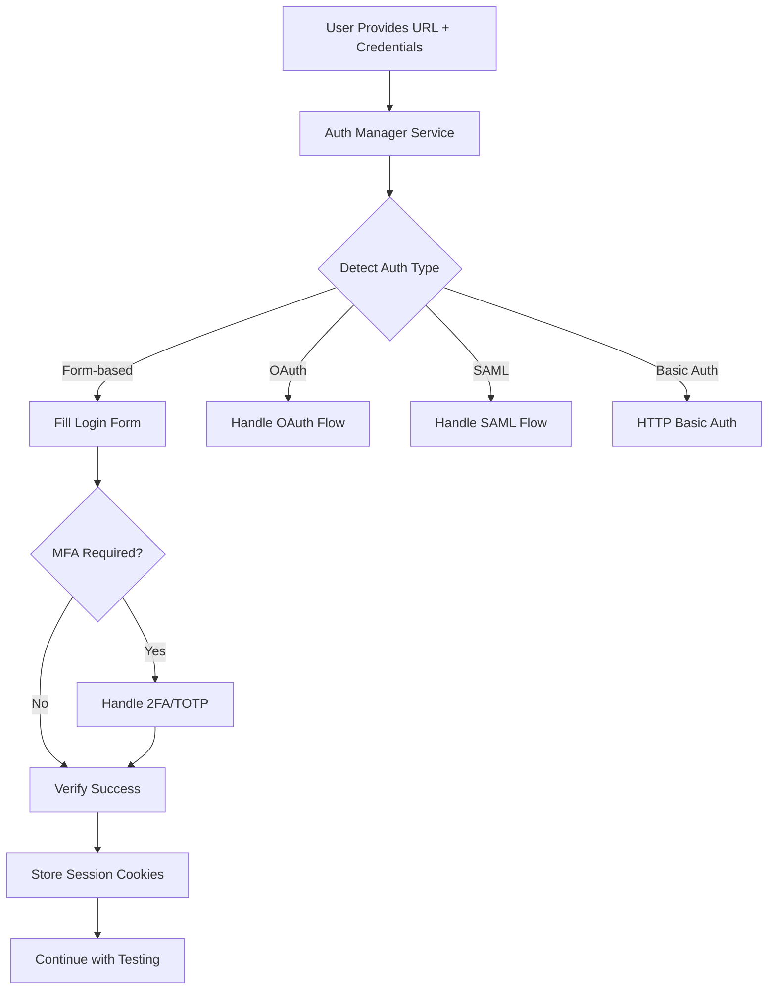

# 🔐 Authentication Guide for QA Automation Platform

## Overview

This guide explains how to handle web application authentication in our QA automation platform. Most real-world applications require login credentials, and our platform provides comprehensive authentication management.

## 🚀 Quick Start

### 1. **Provide Credentials to User Interface**

When users want to test a website, they provide:

```json
{
  "url": "https://app.example.com",
  "credentials": {
    "username": "testuser@company.com",
    "password": "SecurePass123!",
    "additional_fields": {
      "domain": "COMPANY",
      "company_code": "COMP001"
    },
    "mfa_config": {
      "type": "totp",
      "secret": "JBSWY3DPEHPK3PXP"
    }
  }
}
```

### 2. **Authentication Flow**



## 🔧 Implementation Details

### **Authentication Manager Service (Port 8007)**

#### **Core Features:**
- **Multi-Method Support**: Form-based, OAuth, SAML, Basic Auth
- **MFA/2FA Support**: TOTP, SMS, Manual verification
- **Session Management**: Cookie storage and session validation
- **Smart Detection**: Automatic authentication method detection
- **Error Handling**: Detailed error messages and retry logic

#### **API Endpoints:**
```bash
POST /authenticate           # Authenticate with website
GET  /sessions              # List active sessions
GET  /sessions/{url}/cookies # Get session cookies
DELETE /sessions/{url}      # Clear specific session
POST /test-connection       # Test URL accessibility
```

### **Integration with Existing Services**

#### **1. Website Analyzer Integration**
```python
# Before analyzing, authenticate if needed
auth_response = requests.post('http://localhost:8007/authenticate', json={
    "url": "https://app.example.com/dashboard",
    "username": "testuser@example.com",
    "password": "SecurePass123!"
})

if auth_response.json()['success']:
    # Get session cookies
    cookies = requests.get('http://localhost:8007/sessions/https://app.example.com/cookies')
    
    # Use cookies for website analysis
    analysis = requests.post('http://localhost:3001/analyze', json={
        "url": "https://app.example.com/dashboard",
        "cookies": cookies.json()['cookies']
    })
```

#### **2. Test Executor Integration**
```python
# Authenticate before running tests
auth_result = await auth_manager.authenticate_website(
    url=test_suite.url,
    credentials=user_credentials
)

if auth_result.success:
    # Run tests with authenticated session
    test_result = await test_executor.execute_tests(
        test_suite=test_suite,
        session_cookies=auth_result.cookies
    )
```

#### **3. Visual Engine Integration**
```python
# Capture screenshots of authenticated pages
auth_cookies = auth_manager.get_session_cookies(url)

screenshot_result = await visual_engine.capture_screenshot(
    url=url,
    cookies=auth_cookies,
    viewport=viewport_config
)
```

## 🎯 Supported Authentication Methods

### **1. Form-Based Authentication (Most Common)**
```python
credentials = {
    "username": "user@example.com",
    "password": "password123",
    "auth_type": "form_based",
    "additional_fields": {
        "domain": "CORPORATE",
        "remember_me": "true"
    }
}
```

**Automatically detects:**
- Login forms with various selectors
- Username/email fields
- Password fields
- Submit buttons
- Additional fields (domain, company code, etc.)

### **2. Multi-Factor Authentication (MFA/2FA)**
```python
mfa_config = {
    "type": "totp",  # Time-based One-Time Password
    "secret": "JBSWY3DPEHPK3PXP"  # Google Authenticator secret
}

# OR SMS-based (requires SMS service integration)
mfa_config = {
    "type": "sms",
    "phone": "+1234567890"
}

# OR Manual (user provides code manually)
mfa_config = {
    "type": "manual"  # Service waits for user to complete MFA
}
```

### **3. OAuth Authentication**
```python
credentials = {
    "auth_type": "oauth",
    "provider": "google",  # google, microsoft, github, etc.
    "client_id": "your-client-id",
    "client_secret": "your-client-secret"
}
```

### **4. SAML Single Sign-On (SSO)**
```python
credentials = {
    "auth_type": "saml",
    "username": "user@company.com",
    "password": "password123",
    "saml_endpoint": "https://sso.company.com/saml"
}
```

### **5. HTTP Basic Authentication**
```python
credentials = {
    "auth_type": "basic_auth",
    "username": "admin",
    "password": "admin123"
}
```

## 🔒 Security Best Practices

### **1. Credential Storage**
```python
# Credentials are NOT stored persistently
class AuthenticationCredentials:
    def __init__(self, username: str, password: str):
        self.username = username
        self.password = password  # Only in memory
        self.created_at = datetime.utcnow()
    
    # Credentials expire after use
    # No database storage
    # Memory cleared after authentication
```

### **2. Session Management**
```python
# Sessions have configurable timeouts
class AuthenticationResult:
    def __init__(self):
        self.expires_at = datetime.utcnow() + timedelta(hours=1)
        self.cookies = []  # Secure cookie storage
    
    def is_expired(self) -> bool:
        return datetime.utcnow() > self.expires_at
```

### **3. Secure Communication**
- All credentials transmitted over HTTPS
- Passwords handled as SecretStr (Pydantic)
- Session cookies marked as secure/httpOnly
- No plaintext credential logging

## 🛠️ Usage Examples

### **Example 1: Simple Login**
```bash
curl -X POST http://localhost:8007/authenticate \
  -H "Content-Type: application/json" \
  -d '{
    "url": "https://app.example.com/login",
    "username": "testuser@example.com",
    "password": "MySecurePassword123!",
    "timeout": 30,
    "headless": true
  }'
```

### **Example 2: Corporate Login with Domain**
```bash
curl -X POST http://localhost:8007/authenticate \
  -H "Content-Type: application/json" \
  -d '{
    "url": "https://corporate.example.com",
    "username": "john.doe",
    "password": "CorporatePass!",
    "additional_fields": {
      "domain": "CORPORATE",
      "division": "IT"
    }
  }'
```

### **Example 3: Login with 2FA**
```bash
curl -X POST http://localhost:8007/authenticate \
  -H "Content-Type: application/json" \
  -d '{
    "url": "https://secure.example.com",
    "username": "admin@example.com", 
    "password": "AdminPass123!",
    "mfa_config": {
      "type": "totp",
      "secret": "JBSWY3DPEHPK3PXP"
    }
  }'
```

### **Example 4: Test Connection First**
```bash
# Check if authentication is required
curl -X POST http://localhost:8007/test-connection?url=https://app.example.com

# Response:
{
  "url": "https://app.example.com",
  "accessible": true,
  "requires_authentication": true,
  "auth_indicators": ["login", "password", "signin"],
  "status_code": 200
}
```

## 🔄 Complete Workflow Integration

### **Unified Test Generation with Authentication**
```python
# 1. User provides URL and credentials
user_input = {
    "url": "https://app.example.com",
    "credentials": {
        "username": "testuser@example.com",
        "password": "password123"
    },
    "figma_file_key": "ABC123",
    "requirements_file": "requirements.pdf"
}

# 2. Authenticate with application
auth_result = await auth_manager.authenticate_website(
    url=user_input["url"],
    credentials=user_input["credentials"]
)

if not auth_result.success:
    raise AuthenticationError("Failed to authenticate")

# 3. Analyze authenticated application
analysis_result = await website_analyzer.analyze_with_auth(
    url=user_input["url"],
    cookies=auth_result.cookies
)

# 4. Generate unified tests with authenticated context
test_suite = await unified_generator.generate_tests(
    figma_file_key=user_input["figma_file_key"],
    requirements_file=user_input["requirements_file"],
    target_url=user_input["url"],
    authenticated_analysis=analysis_result
)

# 5. Execute tests with authentication
test_results = await test_executor.execute_authenticated_tests(
    test_suite=test_suite,
    auth_cookies=auth_result.cookies
)
```

## 🎯 Advanced Features

### **1. Session Persistence**
```python
# Sessions are maintained across multiple operations
session_valid = auth_manager.is_session_valid("https://app.example.com")

if not session_valid:
    # Re-authenticate if session expired
    await auth_manager.authenticate_website(url, credentials)
```

### **2. Multi-Environment Support**
```python
environments = {
    "dev": {
        "url": "https://dev-app.example.com",
        "credentials": {"username": "dev-user", "password": "dev-pass"}
    },
    "staging": {
        "url": "https://staging-app.example.com", 
        "credentials": {"username": "staging-user", "password": "staging-pass"}
    },
    "production": {
        "url": "https://app.example.com",
        "credentials": {"username": "prod-user", "password": "prod-pass"}
    }
}

# Authenticate with different environments
for env_name, env_config in environments.items():
    await auth_manager.authenticate_website(
        url=env_config["url"],
        credentials=env_config["credentials"]
    )
```

### **3. Headless vs Visual Mode**
```python
# Headless mode for CI/CD
auth_result = await auth_manager.authenticate_website(
    url=url,
    credentials=credentials,
    headless=True  # No browser window
)

# Visual mode for debugging
auth_result = await auth_manager.authenticate_website(
    url=url,
    credentials=credentials,
    headless=False  # Show browser window
)
```

## 🚨 Error Handling

### **Common Authentication Errors**
```python
# 1. Invalid credentials
{
    "success": false,
    "error_message": "Authentication failed - invalid username or password",
    "auth_metadata": {
        "login_attempts": 1,
        "error_type": "invalid_credentials"
    }
}

# 2. MFA required but not configured
{
    "success": false,
    "error_message": "MFA required but no configuration provided",
    "auth_metadata": {
        "mfa_required": true,
        "mfa_type": "totp"
    }
}

# 3. Connection timeout
{
    "success": false,
    "error_message": "Authentication timeout - page took too long to respond",
    "auth_metadata": {
        "timeout_seconds": 30
    }
}

# 4. Captcha or rate limiting
{
    "success": false,
    "error_message": "Rate limited or CAPTCHA detected",
    "auth_metadata": {
        "retry_after": 300
    }
}
```

### **Retry Logic**
```python
max_retries = 3
for attempt in range(max_retries):
    auth_result = await auth_manager.authenticate_website(url, credentials)
    
    if auth_result.success:
        break
    
    if attempt < max_retries - 1:
        await asyncio.sleep(2 ** attempt)  # Exponential backoff
```

## 📊 Monitoring and Logging

### **Authentication Metrics**
```python
# Track authentication success rates
authentication_metrics = {
    "total_attempts": 150,
    "successful_auths": 142,
    "failed_auths": 8,
    "success_rate": 0.947,
    "avg_auth_time": 3.2,
    "mfa_required_count": 45,
    "timeout_count": 2
}
```

### **Security Logging**
```python
# Secure logging (no sensitive data)
logger.info("Authentication attempt", 
           url=url,
           username=username,  # OK to log
           # password=password,  # NEVER log passwords
           auth_type=auth_type,
           success=result.success)
```

## 🎉 Benefits of This Approach

### **1. Complete Automation**
- No manual intervention required for authentication
- Supports complex authentication flows
- Handles MFA automatically

### **2. Security-First Design**
- Credentials never stored permanently
- Secure session management
- Comprehensive error handling

### **3. Universal Compatibility**
- Works with any web application
- Supports all major authentication methods
- Automatic detection and adaptation

### **4. Seamless Integration**
- Works with all existing services
- Maintains sessions across operations
- No changes needed to existing test logic

## 🚀 Getting Started

1. **Start Authentication Manager Service:**
```bash
cd services/python/auth-manager
./start.sh
```

2. **Test Basic Authentication:**
```bash
curl -X POST http://localhost:8007/authenticate \
  -H "Content-Type: application/json" \
  -d '{
    "url": "https://your-app.com/login",
    "username": "your-username",
    "password": "your-password"
  }'
```

3. **Integrate with Testing Workflow:**
```python
# Your existing test code just needs to add authentication step
auth_result = await authenticate_website(url, credentials)
if auth_result.success:
    # Continue with existing testing logic
    test_results = await run_tests(test_suite, auth_result.cookies)
```

This authentication system provides **comprehensive, secure, and automated** handling of web application logins, making your QA automation platform capable of testing **any real-world application** that requires authentication! 🔐✅